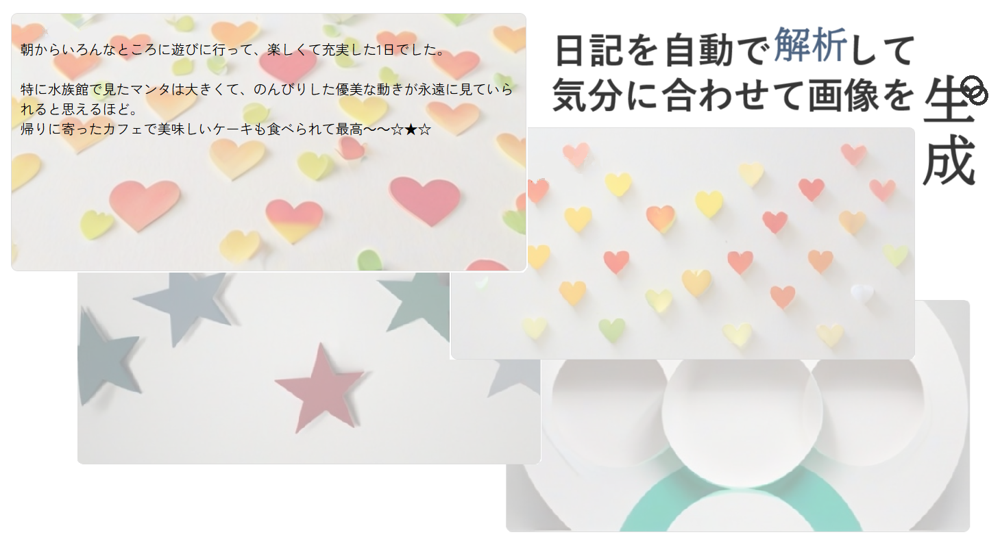

# Diary into Painting
投稿した日記の内容を解析して感情判定し、感情に合わせた画像をAIで自動生成するアプリです。  
画像はボタン一つで再生成も可能で、選んだ画像は自動でその投稿の背景画像に自動設定されます。

---

## Diary into Painting 制作に寄せて
「今日の日記の内容に合わせて背景が自動的に変わったら楽しいんじゃないかな～」という発想から作成したアプリです。  
"自分で選んだ"という満足感を高めるため、ユーザーが画像を気に入らなければボタン一つで再生成できる。
自然言語解析API(HuggingFace経由で無料で使用可能なもの)を見つけることができなかったため、  
今回は [ONE LINE DIARY](https://github.com/MEIKObiastop/ONE_LINE_DIARY) で使用した`.csv`を流用しました。  
画像生成モデルは [ByteDance/SDXL-Lightning](https://huggingface.co/ByteDance/SDXL-Lightning)(Hugging Face API) を使用しています。

---

## 使用技術
- **フロントエンド**: HTML, CSS
- **バックエンド**: Python (Flask + Jinja2 template)
- **データベース**: PostgreSQL
- **ライブラリ**: SQLAlchemy, pytz, csv

---

## 機能一覧
- ユーザー認証: Flask-Login + ハッシュ化パスワードで安全に管理
- 投稿管理: 投稿作成・削除機能、投稿の新着順表示
- 感情解析: CSV辞書を用いた単語ベースのポジティブ/ネガティブ判定
- 画像自動生成: Hugging Face API（ByteDance/SDXL-Lightning）を用いた感情連動画像生成
- 画像管理: 生成中の画像は一時ファイルに保存、投稿確定時に正式保存
- 日付表示: UTC→JST変換により日本時間で表示
- フロントエンド/バックエンド設計: Jinja2テンプレート + Flask + PostgreSQL (Render)
- 再生成機能: ボタン一つで画像を再生成可能、UX向上

---

## 今後の展望
- カレンダー機能の追加(各画像をその日付の背景として設定→1か月の気持ちの流れを振り返られる)
- 生成される画像の多様化(現在は細かく指定している→抽象的な画像生成へ)
- 言語解析API研究(→できれば実装/ネガティブ・ポジティブ判定に加え、外的・内的、言語から読み取れる色合いなど、多面的に解析して画像作成APIに渡すプロンプトに反映)
- 複数画像を同時に提案し、そのなかからどれか1つを選べるようにする
